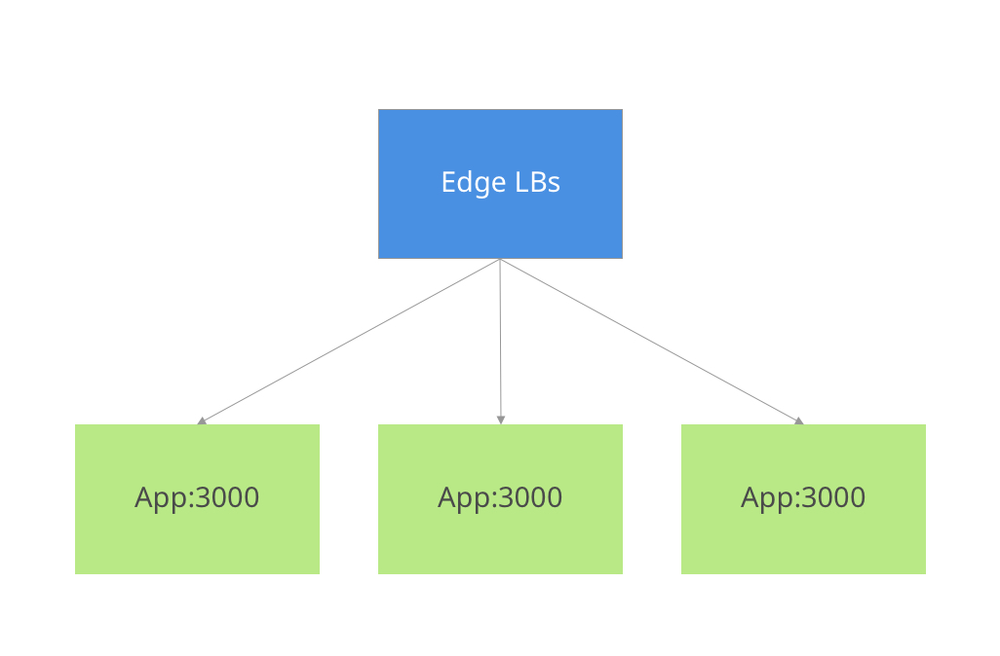
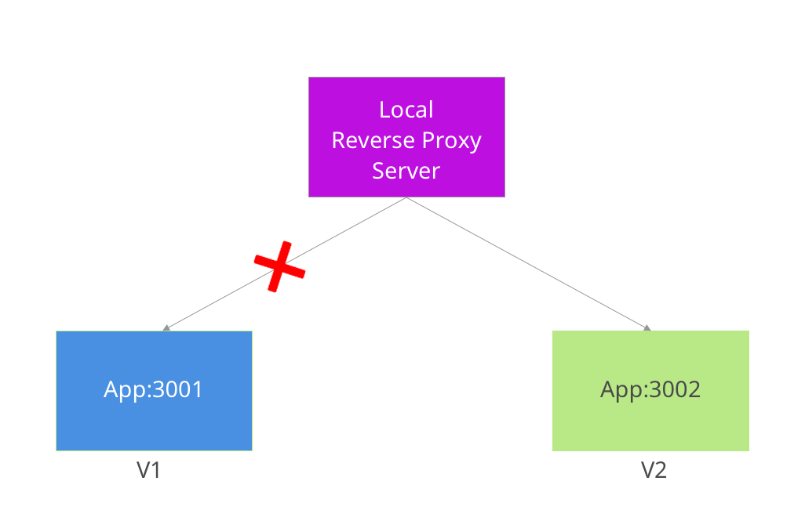

# Blue/Green deployment with Ansible

### Architecture

We've developed an application recently and it provides a REST API to our users. This application is running inside a docker container and deployed on 3 VMs. The traffic is reversed proxy by our Edge loadbalancers which are handled by our infrastructure team.

### Problem

This application is under active development and we have daily releases. However, when we want to deploy the new version of our application, we face a few seconds downtime. It's not acceptable for us to have a few seconds downtime everyday! Our infrastructure team is not happy with the idea of modifying edge load balancers, after a little bit researching, we came up with a blue/green solution by adding a reverse proxy server running on each VM:

### Application

You can see 4 different versions of applications exist in `./apps` folder. The API of application is exposed on port `3000` and currently there are two endpoints implemented:

* `GET /`: prints welcome message with application version
* `GET /healthz`: responds the request with `200` if application is healthy and `500` if it's not.

### TODO

1. An ansible playbook for setting up and configuring the VMs. (Nginx or Haproxy, Docker and firewall should be configured)
2. An ansible playbook for building and pushing docker images to docker hub with correct tags.
23
3. An ansible playbook which deploys the new tag with blue/green technique. You need to make sure the new version is up and healthy, then modify the reverse proxy server to re-route the traffic to the new instance.

You should create a new public GitHub repository and push your solution to it, including a `README.md` file (in English) that can be followed to run the playbooks by anyone who has `ansible` installed on their machine. It would also be good if the README includes a short description of any design choices you made, why they were made, and what alternatives you investigated. Please don't push all of your code once it gets finished, the flow of the commits and development is important as well.

You can spend as little or as much as time you like on this task. We estimate this task to take less than 8 hours (a working day), and we expect to receive the final result (the link of the git repository in GitHub) in 5 days max.

### Bonus points (Optional)

1. An ansible playbook for rolling the application back to the pervious version
2. CI for the playbooks (you can use travis, circle-ci, drone.ci, gitlab-ci, etc)
3. Send a notification/alert/mail to Slack, Telegram or Email when deployment is finished or failed
